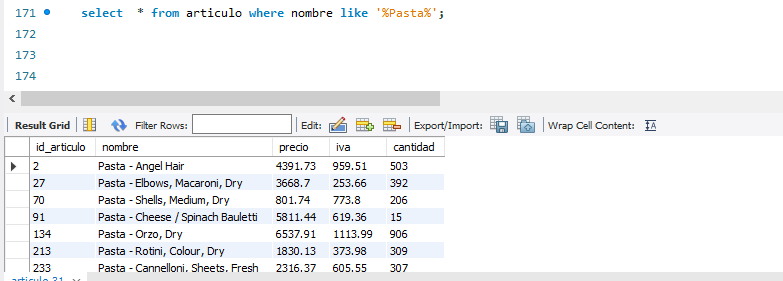
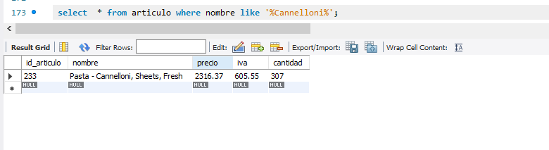
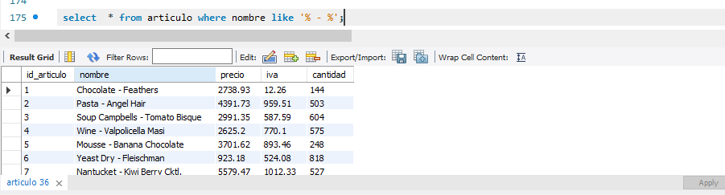
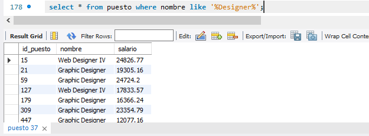
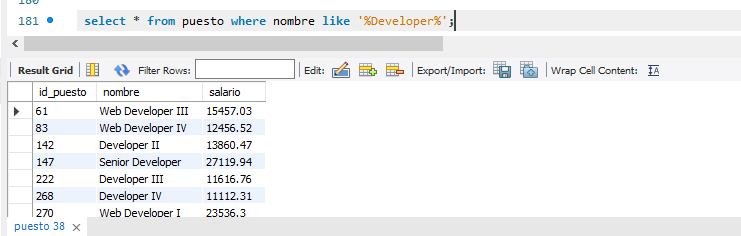
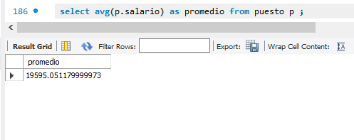
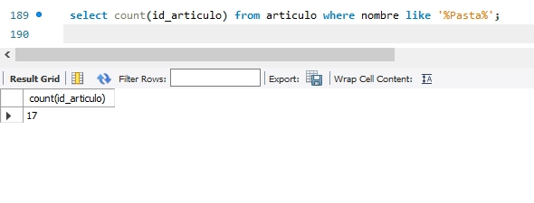
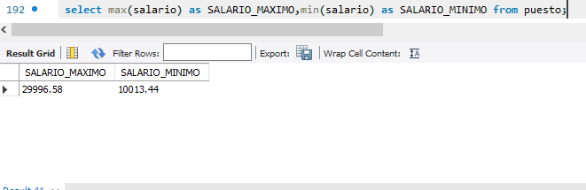
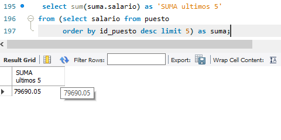

# Reto 1

## ¿Qué artículos incluyen la palabra Pasta en su nombre?
```sql
select  * from articulo where nombre like '%Pasta%'; 
```




## ¿Qué artículos incluyen la palabra Cannelloni en su nombre?
```sql
select  * from articulo where nombre like '%Cannelloni%';
```

 


## ¿Qué nombres están separados por un guión (-) por ejemplo Puree - Kiwi?
```sql
select  * from articulo where nombre like '% - %';
```



## ¿Qué puestos incluyen la palabra Designer?
```sql
select * from puesto where nombre like '%Designer%';
```



## ¿Qué puestos incluyen la palabra Developer?
```sql
select * from puesto where nombre like '%Developer%';
```



# Reto 2


## ¿Cuál es el promedio de salario de los puestos?
```sql
select avg(p.salario) as promedio from puesto p ;
```



## ¿Cuántos artículos incluyen la palabra Pasta en su nombre?
``` sql
select count(id_articulo) from articulo where nombre like '%Pasta%';
```



## ¿Cuál es el salario mínimo y máximo?
``` sql
select max(salario) as SALARIO_MAXIMO,min(salario) as SALARIO_MINIMO from puesto;
```



## ¿Cuál es la suma del salario de los últimos cinco puestos agregados?
```sql
select sum(suma.salario) as 'SUMA ultimos 5'
from (select salario from puesto
      order by id_puesto desc limit 5) as suma; 
```



